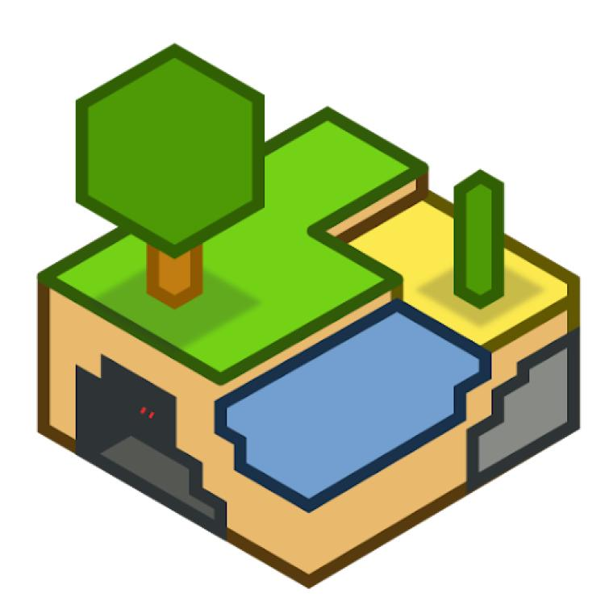

# Craftree
The official development profile for Craftree — a voxel game by Luan Labs.

# 🌳 CRAFTREE

### A voxel game powered by the Craftree Engine

  

---

# 🌳 About Craftree

**Craftree** is a voxel-based game powered by the **Craftree Engine** and developed by **Luan Labs**.

Craftree started as an experimental voxel game project and has grown through custom engine development, gameplay experiments, networking work, performance improvements, interface redesigns, branding, and standalone distribution.

The long-term goal is to develop Craftree into a more independent game and engine ecosystem.

> ⚠️ **Craftree is currently in development and has not been publicly released.**

This repository is a **public project profile**.

The Craftree source code and private development files are **not publicly released in this repository**.

---

# ⚙️ Craftree Engine

The **Craftree Engine** is the technology behind Craftree.

Development focuses on creating a flexible voxel engine capable of supporting:

- 🌍 Procedural worlds
- 🧱 Block-based environments
- 🎮 Player movement
- 👥 Multiplayer
- 🌐 Networking
- 🔧 Modding and customization
- 🖥️ Desktop platforms
- 📱 Mobile platforms
- ⚡ Performance optimization
- 🔒 Security
- 📦 Standalone distribution

Craftree Engine is being developed with a long-term goal of becoming increasingly independent from its original technology base.

---

# 💻 Platforms & Devices

Craftree Engine is being developed with cross-platform support in mind.

The underlying technology supports a wide range of platforms, and Craftree development is working toward bringing the project to multiple devices.

| Platform | Device type | Status |
|---|---|---|
| 🪟 Windows | PC / Laptop | 🟢 Development |
| 🐧 Linux | PC / Laptop | 🟡 Planned / Development |
| 🍎 macOS | Mac / MacBook | 🟡 Planned |
| 🤖 Android | Phones / Tablets | 🟡 Planned |
| 🐧📱 Linux Phones | Linux mobile devices | 🟡 Experimental |
| 🍎📱 iOS | iPhone / iPad | 🔴 Not currently supported |

### Android architectures

The engine technology supports:

- ARMv7
- ARM64 / AArch64
- x86
- x86_64

Android support is intended for phones and tablets.

> Platform availability for **Craftree itself depends on the specific Craftree Engine build and release**.

---

# 🎮 Game Features

Craftree is being developed around a voxel sandbox experience.

### 🌍 World

- Procedurally generated terrain
- Large voxel environments
- Underground areas
- Caves
- Landscapes
- Structures
- Exploration

### 🧱 Building

- Place blocks
- Break blocks
- Build structures
- Modify terrain
- Create custom environments

### 👤 Player

- First-person gameplay
- Player movement
- Inventory systems
- Interaction
- Multiplayer player synchronization

### 🌐 Multiplayer

Craftree Engine is designed around multiplayer support.

Development includes:

- Server connections
- Player synchronization
- Network handling
- Server configuration
- Connection validation
- Multiplayer stability

---

# 🛠️ Development History

The following is an **internal development archive / project lore** documenting experimental stages of Craftree.

---

## v1.0 — First Prototype

The first prototype was created to test the basic voxel world.

Early bugs included:

- `BUG-0001` — Player spawned inside terrain
- `BUG-0007` — Floating terrain
- `BUG-0013` — Block visual desynchronization
- `BUG-0019` — Game refused to close

The prototype established the foundation for later development.

---

## v1.8 — World Generation Incident

World generation was heavily experimented with.

Some experimental algorithms produced:

- Floating islands
- Massive underground areas
- Broken terrain borders
- Unexpected terrain gaps

The generation system was reworked.

---

## v2.0 — Multiplayer

Multiplayer development began.

One of the most memorable internal bugs:

### `BUG-0142` — Ghost Player 👻

A disconnected player could occasionally remain visible to other players.

The synchronization system was later redesigned.

---

## v2.7 — Entity Experiments

More advanced entity systems were introduced.

### `BUG-0204` — Infinite Walk

An experimental movement issue allowed the player to continue moving under certain conditions without properly stopping.

Fixed during movement-system revisions.

---

# 🔥 v3.0 — Major Rewrite

The project entered a major development phase.

Several systems were reorganized:

- World management
- Entity handling
- Rendering
- Networking
- User interface
- Configuration
- Game initialization

This became one of the largest internal development stages.

---

# 🌐 v4.0 — Networking & Security

Networking received major attention.

Development focused on:

- Connection handling
- Multiplayer synchronization
- Player limits
- Server configuration
- Network stability
- Security hardening

---

## v4.4 — Player Limit Incident

An experimental configuration could effectively allow an unrestricted number of players under certain conditions.

The configuration was disabled while the player-management system was redesigned.

---

## v4.7 — Hardening

Additional work focused on:

- Server validation
- Connection handling
- Configuration safety
- Multiplayer stability

---

# 🧹 v5.0 — Cleanup

Craftree entered a major cleanup phase.

Unused systems were removed and multiple parts of the project were reorganized.

The focus shifted toward creating a cleaner and more maintainable engine.

---

# 🚫 v5.3 — "Forbidden Build"

An experimental build contained several features that were never intended for public distribution.

The build was archived internally.

Some experimental systems were later redesigned or removed.

---

# 🎨 v5.5 — Branding & Interface

Craftree began developing its own visual identity.

Work included:

- Custom Craftree branding
- Luan Labs branding
- Custom UI
- Application identity
- Engine presentation
- Distribution changes
- Project-specific interfaces

---

# 🚀 v5.7 — Current Development

Current development focuses on making Craftree feel increasingly like its own engine and game ecosystem.

Current areas include:

- ⚙️ Craftree Engine development
- 🌍 World generation
- 🎮 Gameplay
- 🌐 Multiplayer
- 🖥️ UI
- 📦 Distribution
- 🔒 Security
- ⚡ Optimization
- 🧹 Code cleanup
- 🎨 Branding

---

# 🐛 Internal Bug Archive

| ID | Description | Status |
|---|---|---|
| BUG-0001 | Spawned inside terrain | ✅ Fixed |
| BUG-0007 | Floating terrain | ✅ Fixed |
| BUG-0013 | Block visual desync | ✅ Fixed |
| BUG-0019 | Game refused to close | ✅ Fixed |
| BUG-0142 | Ghost Player | ✅ Fixed |
| BUG-0204 | Infinite Walk | ✅ Fixed |
| BUG-0666 | Classified 👀 | ❓ |

> Some entries are intentionally kept as internal development lore.

---

# 🗺️ Roadmap

## Current

- [x] Craftree branding
- [x] Luan Labs branding
- [x] Custom project identity
- [x] Craftree Engine branding
- [x] Initial engine modifications
- [x] Standalone Windows build
- [x] Installer experiments
- [ ] More gameplay systems
- [ ] Multiplayer improvements
- [ ] UI redesign
- [ ] More optimization
- [ ] Public testing

## Future

- [ ] Expanded Craftree Engine
- [ ] More independent engine systems
- [ ] Android builds
- [ ] Linux builds
- [ ] macOS builds
- [ ] Modding ecosystem
- [ ] Dedicated Craftree services
- [ ] Community infrastructure
- [ ] Public release

---

# ⭐ Rate Craftree

Want to rate Craftree?

Click a rating below and submit your feedback through GitHub Issues.

### ⭐⭐⭐⭐⭐

### ⭐⭐⭐⭐

### ⭐⭐⭐

### ⭐⭐

### ⭐

---

# 💬 Community & Support

### SLBR • Uncopylocked Discord

https://discord.gg/uncopylocks

### Nemea Hosting

https://nemeahosting.com

---

# 🏢 Luan Labs

**Luan Labs** is the studio behind Craftree.

The studio focuses on games, technology, engine development, experimentation, and online infrastructure.

  

**Luan Labs**

---

# 🌳 Craftree

### Build. Explore. Create.

**Powered by the Craftree Engine.**

**Made by Luan Labs.**

